### Hi, I'm Varad More 👋

I build fast AI systems and robust cloud infrastructure. Previously a founding engineer at Sharp Data Analytics and a startup co-founder, I focus on hardware-level inference optimization, scalable backend systems, and contributing to open-source observability tools.

## Stack

- Languages: Python · C++ · TypeScript · JavaScript · Java · Bash
- AI/ML: PyTorch · Triton · CUDA · TensorFlow · OpenCV · NumPy · Pandas
- Cloud & DevOps: AWS · GCP · Terraform · Docker · Kubernetes · Nginx
- Tools: FastAPI · Django · Flask · Node.js · React · GraphQL · PostgreSQL · Git

## Elsewhere

[varadmore.me](https://varadmore.me) | [LinkedIn](https://www.linkedin.com/in/varad-more/) | [X](https://x.com/VaradMore1) | [Google Scholar](https://scholar.google.com/citations?user=J_My0doAAAAJ&hl=en) 

